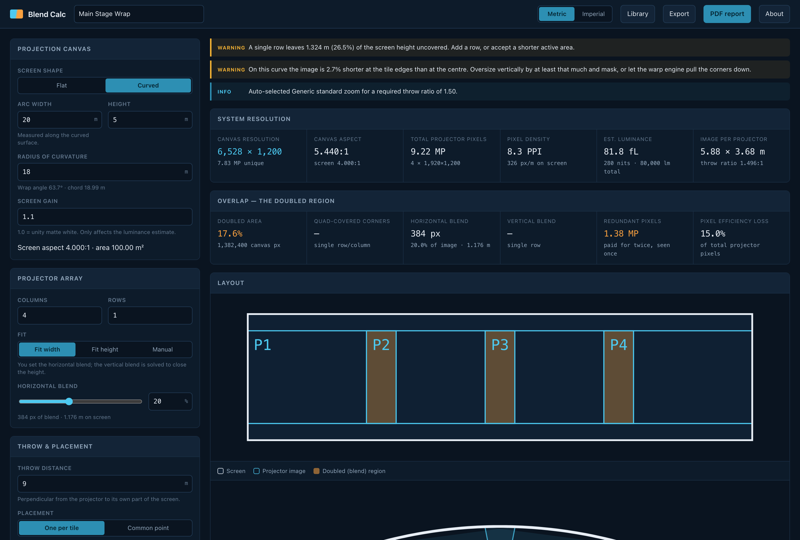

# Blend Calc user guide

Blend Calc is **a projector edge-blend calculator that runs entirely in the browser**. Define a
projection canvas, set the array, pick a projector and lens from a library you control, and get the
system resolution, the overlap budget, the lens requirement per position, a PDF report, and a
Resolume Arena advanced-output file.

No backend, no accounts, no telemetry. Everything is computed client-side and stored in the
browser.

*A 20 m × 5 m cylindrical screen on an 18 m radius, four projectors wide at 20% blend. The warnings
are live: this array leaves 26.5% of the screen height uncovered, and the curve makes the image
2.7% shorter at the tile edges than at the centre.*

> **Before you rely on this:** the blend, pixel-budget and curved-optics maths is verified
> numerically — 66 tests pin the conservation invariants, the flat and curved limit cases and the
> lens-selection logic — and the PDF report is generated and inspected across flat, curved,
> single-projector, large-array and deliberately broken designs.
>
> **The shipped projector and lens specifications are seed data, flagged `unverified` throughout.**
> The Resolume exporter's vocabulary was derived from real Arena 7.27.0 files and is asserted in CI
> to invent nothing, but **it has not been round-tripped through a running Arena**, and **no blend
> has ever been driven onto real projectors from it.**
>
> This codebase was created with AI assistance, directed and reviewed by a human author.

---

## The canvas

**Flat or cylindrical.** On a curve you give the **arc width — measured along the surface, the way
a screen is actually built** — and the radius; the wrap angle and chord fall out of that.

## The array, and which blend you pin

Any grid of columns × rows. **You pin one blend and the solver derives the other** so the array
closes on the screen exactly:

| Fit mode | You set | Solver derives |
|---|---|---|
| **Fit width** | horizontal blend | vertical blend |
| **Fit height** | vertical blend | horizontal blend |
| **Manual** | both | reports the spill or shortfall instead of correcting it |

Manual is the honest mode when the array is fixed by rigging rather than by arithmetic — it tells
you what you are short by rather than quietly moving a projector.

---

## The doubled region, which is what makes blends expensive

Blend bands are covered by **two** projectors; where a horizontal and a vertical blend cross, by
**four**.

The report separates all three cases, in canvas pixels and as a share of the canvas, and totals
**the redundant pixels you pay for twice and see once.**

That total is the number to take to a hire quote. It is also the number that decides whether a
2×2 array of one projector class beats a 1×4 of another.

---

## System resolution and light

The blended canvas size, total projector pixels, **pixel density on the screen surface in PPI**,
and an estimated screen luminance in foot-lamberts and nits.

Luminance is an estimate from the projector's rated output — it knows nothing about your screen
gain, ambient light or lamp hours.

---

## Throw and lens

Required throw ratio per column, the lens that covers it, **where it sits in its zoom range**, and
the horizontal lens shift needed.

Two placement models, and they are genuinely different jobs:

- **One per tile** — each projector on the axis of its own tile. No shift needed.
- **Common point** — the whole array stacked at one position. Off-axis tiles need shift, and **on a
  curve the throw varies per column.**

"Where it sits in its zoom range" is the field to read before ordering: a lens at the very end of
its range is a lens with no adjustment left on site.

---

## Curved screens are not flat maths with a fudge factor

A projector forms a **flat** image; a curved screen does not — so the flat image has to be **wider
than the tile's arc length** to reach around the curvature.

Two consequences the tool reports and a flat calculator misses:

- **You need a wider lens than the flat maths suggests.**
- **The image is shorter at the tile edges than at the centre**, because a concave screen's edges
  bulge towards the projector. You oversize vertically and mask, or let the warp engine pull the
  corners down. **The percentage is on screen and in the report.**

A projector at the centre of curvature (throw = radius) is a normal, often ideal position and is
handled. The real constraint is that **the projector must be in front of the plane through its own
tile's edges.**

---

## The library is yours

Projectors by brand and model with their native resolution, light output and lens mount; lenses
grouped into **mount families**, so they are entered once rather than once per body.

Fully editable, with JSON import and export — which is how you carry a hire company's real stock
between machines.

**The shipped data is seed data and is flagged unverified.** Check a spec against the manufacturer
before it decides a purchase.

---

## Exports

A **PDF system report**, a **Resolume Arena advanced-output XML**, and the design itself as JSON.

The Arena export writes only elements and attributes seen in real Arena files, and CI asserts it
invents none — but it has never been loaded back into a running Arena. Treat the first import as a
test.

---

## If something looks wrong

| Symptom | Cause |
| --- | --- |
| **The array does not cover the screen** | You are in Manual fit. It reports the shortfall rather than correcting it. |
| **The lens is at the end of its zoom** | Read the range field — that is what it is for. Choose another lens or move the array. |
| **The image is short at the tile edges** | A concave screen. Oversize vertically and mask, or warp. The percentage is reported. |
| **The pixel count is much higher than the canvas** | The doubled region. That is the cost of blending, itemised. |
| **A projector spec looks wrong** | It is seed data, flagged unverified. Edit the library. |
